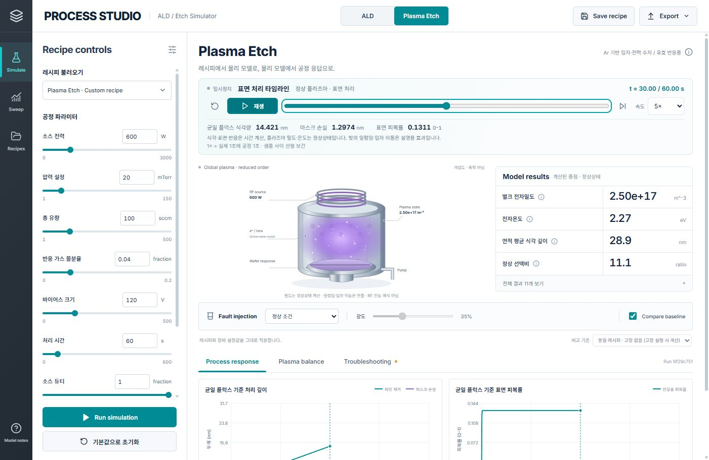

# Process Studio — ALD / Plasma Etch Simulator

**v0.3: 시간 재생·수식 설명·목표 규격 평가를 지원하는 로컬 ALD / Plasma Etch Simulator.**

레시피와 장비 상태를 직접 바꾸고, 계산된 공정 결과를 비교하는 로컬 시뮬레이터입니다.
AMK PSE 준비를 위해 공정 원리 → 관측 → 가설 → 평가 → 조치 검증을 공부하는 프로젝트입니다.
Python 모델과 React 화면은 AI 도구의 지원으로 구현했으며, 직접 검토한 가정·실험·해석을 별도 기록합니다.

| 모듈 | 구현한 계산 | 조절 항목 |
| --- | --- | --- |
| Thermal ALD | 챔버 분압 응답, 36셀 반응·확산, A/B 표면 포화와 성장 | 17개: 주입·퍼지·분압·온도·형상·반응 계수 등 |
| Plasma Etch | Ar 입자·에너지 수지, 라디칼 수지, 표면 반응과 제거 | 31개: 전력·압력·유량·바이어스·형상·수율 등 |

전자 밀도와 전자 온도는 수지식으로 계산합니다. 고급 모델 계수는 가정을 탐구하는 입력이며, 모두 실제 장비의 독립 레시피 조절 항목을 의미하지는 않습니다.
고장 7종은 RF 전달, 압력, 공급, 배기, 온도, 벽 상태 등 상류 상태를 바꿉니다. 결과 KPI를 고장별 상수로 지정하지 않습니다.

화면에서 레시피 편집, 정상/고장 비교, 단일 변수 스윕, 실험 메모, 레시피 저장, JSON·CSV 내보내기를 사용할 수 있습니다.

**공정 평가**는 사용자가 정한 목표와 계산값을 비교하고, 미달 이유·다음 확인·미계산 품질을 표시합니다. 예제 규격은 산업 공통 합격 기준이 아닙니다. **수식·원리**는 구현한 식, 변수 단위와 현재 계산값을 연결합니다. [평가 방법과 실행한 PSE 연습 사례](docs/PROCESS_ASSESSMENT_KR.md)를 참고하세요.

Run simulation은 Python 계산 후 `t=0`부터 반응기와 시간 그래프를 함께 재생합니다. 일시정지·시간 탐색·0.25–20× 속도를 지원합니다. ALD는 첫 사이클의 분압·성장, Etch는 정상 플라즈마 아래 표면 반응·식각량을 재생합니다. 플라즈마 일렁임과 이동 입자는 설명용 효과이며 점화·RF 진동의 해석 결과는 아닙니다.



**범위:** 교육·연구용 축약 모델입니다. 실제 Applied Materials 장비나 고객 레시피에 맞춰 보정한 모델이 아닙니다.
ALD 총 두께는 첫 사이클 × N 투영이며, Etch는 0D 플라즈마와 가정한 방사형 분포를 사용합니다.
3D 전자기장·RF 방전·패턴 측벽 진화·실제 재료 반응망 전체를 계산하지 않습니다.

## 실행

Python 3.10+, Node.js 22.12+, pnpm이 필요합니다.

```powershell
python -m pip install -r sim_app/requirements.txt
cd sim_app/frontend
pnpm install --frozen-lockfile
pnpm build
cd ../..
python sim_app/server.py
```

브라우저에서 **http://127.0.0.1:8765**를 엽니다. API 키가 필요하지 않습니다.

## 모델과 검증

- [사용법과 첫 고장·조치 실험](docs/PROCESS_STUDIO_KR.md)
- [목표 규격 평가·수식 설명·PSE 사례](docs/PROCESS_ASSESSMENT_KR.md)
- [ALD 모델: 방정식·단위·가정·출처](docs/ALD_MODEL.md)
- [Etch 모델: 방정식·단위·가정·출처](docs/ETCH_MODEL.md)

```powershell
python -m unittest discover -s sim_app/tests -v
python sim_app/run_reference_cases.py --out outputs/process_studio/reference_cases
```

ALD 18개·Etch 14개·API 9개의 테스트가 있습니다. 무주입/무전력, 포화, 수지 잔차, 단위, 입력 경계, 고장·복구, ALD 격자/시간 민감도, 재현성 및 API 동작을 확인합니다. 재생용 공간 프레임은 원래 해의 해당 시각 및 종점과 비교합니다. 프런트엔드 디렉터리의 `pnpm test`는 19개 테스트로 레시피 검증·CSV 무효값 처리·그래프 숫자 표시·재생 보간·단계 경계·시간 단위·규격 경계·평가 불가 처리·비교 기준의 독립 조건·보고서 규격 보존을 확인합니다. 테스트 통과는 수치·구현 검증이며 실제 공정 정확도의 증거는 아닙니다.
조건과 모델 버전을 포함한 JSON, 비교 지표 CSV를 재생성할 수 있습니다. 생성 결과는 `outputs/`에 저장하며 Git에서 제외합니다.

## 저장소 구조

```text
sim_app/models/       Python ALD / Etch models
sim_app/frontend/     React + TypeScript interface
sim_app/server.py     Local model API and UI server
sim_app/tests/        Numerical and API checks
docs/                Model assumptions, sources and usage
learning/            Earlier introductory learning notes
study_lab/           Earlier synthetic-data exercises
```

<details>
<summary>이전 Etch + PVD 입문 실습과 계획</summary>

아래 내용은 시뮬레이터 개발 전의 입문 자료입니다. 현재 앱의 실행과 모델 범위는 위 `sim_app/` 안내를 사용합니다.

**Status: Etch + PVD starter available; DOE and independent recovery evaluation planned.**

[01단계: 문제 정의](learning/01_problem_definition_KR.md)부터 함께 시작합니다.
[실행 안내](START_HERE_KR.md)에서 준비된 데이터 생성기를 실행할 수 있습니다.
AMK PSE 지원을 위해 Etch와 Deposition/PVD 두 사례에서 공정에 대한 관심과 문제 해결 능력을 보여주는 중소 규모 프로젝트입니다.
완료 목표는 공정별 가설 비교·작은 DOE·독립 확인, 최종 그림 총 6장과 사례 보고서 2쪽입니다.
`study_lab`은 합성 학습 fixture이며 실제 장비 모델이나 검증된 공정 simulator가 아닙니다.

PSE 직무 준비를 위해 합성 데이터로 공정 이상을 분석하고,
가설을 구분하는 평가와 조치 후 검증 과정을 구현할 예정인 프로젝트입니다.

## 함께 진행하는 순서

매 단계에서 **공정 개념 → 작은 계산/코드 → 실행 결과 → 자신의 해석**을 남깁니다.
현재는 저장소 준비와 첫 학습 안내까지이며, 학습자의 해석과 사례 보고서는 아직 작성 전입니다.

| 위치 | 역할 | 현재 상태 |
| --- | --- | --- |
| `learning/` | 한 번에 한 단계씩 이해하고 답하는 학습 안내 | 01 문제 정의부터 시작 |
| `docs/` | 프로젝트 전체 범위와 완료 기준 | 계획 문서 제공 |
| `study_lab/` | 교육용 합성 데이터 생성 코드 | 실행 가능 |
| `study_lab/tests/` | 코드 재현성·계산 관계 확인 | 테스트 제공 |
| `outputs/` | 실행하면서 생성하는 CSV와 작성 양식 | Git 업로드 제외 |

Git은 내 PC에서 변경 이력을 남기는 도구이고, GitHub는 그 저장소를 공유하는 서비스입니다.
앞으로 이해하고 확인한 작업 단위마다 commit을 남겨 진행 과정을 보여줍니다.
코드 작성에는 AI 도구를 활용하며, 학습자가 직접 검토한 가정·판단·검증 범위는 각 단계의 기록으로 구분합니다.

## 문제와 접근

- **Etch:** rate·CD·균일도와 RF·압력 관측을 비교하고 공정 상태와 모니터 bias를 구분합니다.
- **PVD:** 두께·sheet resistance·reference 계측을 비교하여 두께 변화, 막 특성 변화, 계측 오차를 구분합니다.
- 각 사례에서 가설을 구분하는 평가, 고정/변경 조건, 반증 기준과 여러 KPI의 검증을 기록합니다.
- 두 사례는 독립 실습이며 하나의 실제 연속 제조 공정으로 검증된 모델이 아닙니다.

## 모델 범위

- Physics-inspired synthetic model; no proprietary Applied Materials recipes or customer data.
- 공정 변수, 단위, 가정과 관측 가능한 범위를 명시합니다.
- 합성 환경에서의 결과를 실제 장비의 성능 검증으로 표현하지 않습니다.

## 현재 실행 가능한 범위

`study_lab/run_amk_starter.py`가 Etch 80 wafer와 PVD 45 wafer × 9 site의 관측, 별도 정답, manifest, 작성 양식을 생성합니다.
PVD는 일반적인 단일 도전막의 `R_sheet = rho / t` 관계를 사용하는 교육용 fixture입니다.
특정 재료의 물성·PVD 수송·plasma chemistry를 검증한 모델이 아닙니다.

2026-09-28에 `python -m unittest discover -s study_lab/tests -v`를 실행하여 13개 테스트가 통과했습니다.
검증 범위는 재현성·정답 분리·case 방향·단위 관계·NU 계산·입력 검사입니다.

DOE용 조건 변경 모델, recipe 선택, 독립 회복 검증과 최종 보고서는 학습하며 구현할 단계입니다.

Day 1 실행 명령과 학습 순서는 [시작 안내](START_HERE_KR.md)에 있습니다.
현재 범위와 데이터·실험·검증 조건은 [AMK PSE 전용 프로젝트 명세](docs/AMK_PSE_PROJECT_SPEC_KR.md)에 정리했습니다.
기존 세 직무 통합 명세와 `run_day1.py`는 이전 학습 자료입니다. 현재 AMK 프로젝트의 실행 진입점은 `run_amk_starter.py`입니다.
전체 진단 시스템의 정량 결과는 해당 구현과 검증을 마친 뒤 추가합니다.

</details>
